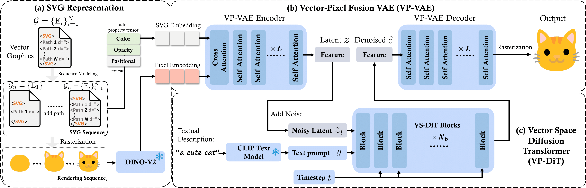

# SVGFusion: Scalable Text-to-SVG Generation via Vector Space Diffusion

[](https://ximinng.github.io/SVGFusionProject/)

Official implementation for "SVGDreamer++: Advancing Editability and Diversity in Text-Guided SVG Generation"

## 🚀 Stay Tuned: Code Release Coming Soon

<figure style="margin-bottom: 20px;">
  
  <figcaption style="text-align: center;">
    Overview of SVGFusion. (a) Our pipeline begins with the neural representation of SVGs, where XML-defined SVG tensors are transformed into a learnable matrix to derive an SVG embedding (Sec. 3.1). (b) We propose the Vector-Pixel Fusion Variational Autoencoder (VP-VAE, Sec. 3.2) within a transformer-based architecture to encode vector embeddings alongside pixel-level features into a latent vector space. The resulting vectors are subsequently decoded using a transformer decoder, which parallels the encoder, to reconstruct vector graphics. (c) The Vector Space Diffusion Transformer (VS-DiT, Sec. 3.3) is then trained within the latent space constructed by the VP-VAE. Textual features extracted from the text prompt using the CLIP models are incorporated into each VS-DiT block. The generative capability of SVGFusion can be continuously enhanced by stacking additional VS-DiT blocks.
  </figcaption>
</figure>

## :paperclip: Citation

If you use this code for your research, please cite the following work:

```
@article{xing2024svgfusion,
  title={SVGFusion: Scalable Text-to-SVG Generation via Vector Space Diffusion},
  author={Xing, Ximing and Hu, juncheng and Zhang, Jing and Xu, Dong and Yu, Qian},
  journal={arXiv preprint},
  year={2024}
}
```

## :copyright: Licence

This work is licensed under a MIT License.